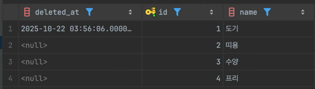
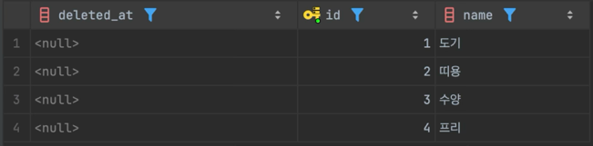
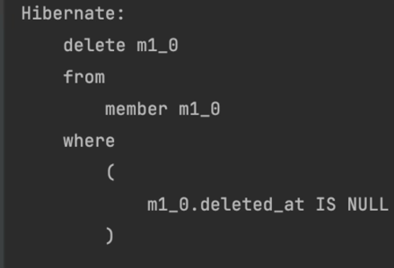

# 소프트 딜리트를 적용하는 이유와 사례

## 서론 - 삭제는 진짜 삭제일까?

우리는 댓글을 지우거나, 계정을 탈퇴하여 정보를 제거합니다.

```sql
DELETE
FROM users
WHERE id = 123;
```

위 SQL을 실행하면 데이터는 물리적으로 제거됩니다.
<br>
하지만 만약 탈퇴한 계정을 복구하고싶다면 어떻게 해야 할까요?
<br>
다음과 같은 문제가 발생합니다.

- 실수로 삭제를 했다면 복구할 수 없다.
- 누가, 언제, 왜 삭제했는지 알 수 없다.
- 삭제된 사용자의 주문 내역이 외래키 제약으로 함께 삭제된다면

실제로 페이스북은 계정 삭제 후 30일간 데이터를 보관하며, AWS는 삭제된 리소스의 이력을 CludeTrail로 추적합니다.
<br>
이외에도 수 많은 서비스는 데이터 복구에 대한 방법을 준비해두고 있습니다.
<br>
이들은 데이터를 어떻게 삭제하고 있을까요? 그리고 우리는 어떻게 데이터를 안전하게 관리할 수 있을까요?

## 대상 독자

- 백엔드 개발자(Java, Spring, JPA 환경)
- 데이터베이스 개발자
- 소프트 딜리트를 처음 접하는 개발자

## 사전 지식

- Java 기본 문법
- Spring Boot 기본 구조
- JPA 기본 개념 (Entity, Hibernate)
- SQL의 DELETE, UPDATE 쿼리 문
- 외래키(Foreign Key) 제약조건

# 목차

1. 하드 딜리트의 한계
2. 소프트 딜리트란 무엇인가?
3. Spring Boot + JPA에서 소프트 딜리트 구현
4. @Where Deprecated 주의사항
5. 소프트 딜리트 구현 방법 비교 정리
6. 실무 적용 사례
7. 소프트 딜리트 적용시 주의할 점
8. 마무리

---

## 1. 하드 딜리트의 한계

```java
userRepeository.deleteById(userId);
```

이 메서드를 실행하면 회원은 데이터베이스에서 제거됩니다.
<br>
여기서 발생할 수 있는 문제가 무엇일까요?

- 실수로 삭제한 데이터의 복구 요청 -> 불가능
- 회원 테이블과 관계를 맺고있던 주문 테이블의 외래키 제약으로 인한 회원 삭제 실패

삭제가 되어도 문제고 삭제가 안되어도 문제입니다.

하드 딜리트는 데이터를 데이터베이스에서 물리적으로 제거하여, 데이터베이스의 용량을 차지하지 않을 수 있다는 장점도 있지만, 데이터 복구요청에 대응하지 못한다는 단점이 있습니다.
<br>
실제 서비스를 운영중이라면 이러한 상황은 피해야할 것 입니다. 그러면 어떻게 하면 좋을까요?
<br>
데이터를 삭제한 것 처럼 위장하면 될 것입니다.

## 2. 소프트 딜리트란 무엇인가?

소프트 딜리트란 데이터를 물리적으로 삭제하지 않고, 삭제 여부를 표시하는 플래그 또는 타임스탬프를 사용하여 삭제처리 하는 방식입니다.

### 2.1 왜 등장하였는가?

데이터를 물리적으로 삭제하는 것에는 한계가 있었습니다.

- GDPR, 개인정보보호법 등 법적 요구사항
- 비즈니스 요구: 고객 문의 대응, 데이터 복구, 감사 추적
- 기술적 요구: 외래키 무결성 유지

위와 같은 이유로 데이터를 논리적으로 삭제하는 소프트 딜리트가 등장하였습니다.

## 3. Spring Boot + JPA에서 소프트 딜리트 구현

소프트 딜리트 구현방법에는 크게 3가지 방법이 있습니다. 하나씩 알아보겠습니다.

### 3.1 수동 구현

레포지토리와 서비스 레이어에서 직접 구현 하는 방식입니다.

```java

@Entity
@Table(name = "users")
public class User {
    @Id
    @GeneratedValue(strategy = GenerationType.IDENTITY)
    private Long id;

    private String email;

    @Column(name = "deleted_at")
    private LocalDateTime deletedAt;

    public void softDelete() {
        this.deletedAt = LocalDateTime.now();
    }

    public boolean isDeleted() {
        return this.deletedAt != null;
    }
}
```

User 엔티티에 삭제 플래그인 deletedAt 컬럼을 추가합니다.

```java

@Service
public class UserService {

    @Transactional
    public void deleteUser(Long userId) {
        User user = userRepository.findById(userId)
                .orElseThrow(() -> new UserNotFoundException(userId));

        user.softDelete();
        userRepository.save(user);
    }
}
```

삭제 요청을 받으면 서비스 레이어에서 User 엔티티에 구현되어있던 softDelete() 메서드를 호출하여
deletedAt 필드의 값을 삭제한 시간으로 변경합니다.

```java
public interface UserRepository extends JpaRepository<User, Long> {

    @Query("SELECT u FROM User u WHERE u.deletedAt IS NULL")
    List<User> findAllActive();

    @Query("SELECT u FROM User u WHERE u.id = :id AND u.deletedAt IS NULL")
    Optional<User> findActiveById(@Param("id") Long id);
}
```

그리고 레포지토리의 쿼리메서드에 deletedAt IS NULL 조건을 명시해줍니다.
<br>
이렇게 직접 명시해주는 이유는 데이터를 조회할 때 삭제 처리된 데이터는 조회하지 않기 위함입니다.

장점

- 명시적이고 이해하기 쉽습니다.
- 프레임 워크와 Hibernate 버전에 독립적입니다. (Spring Data JPA만 있으면 동작)
- 개발자가 삭제 조건을 세밀하게 조정할 수 있습니다. (특정 쿼리에서만 삭제 조건 제외 등)

단점

- 모든 레포지토리 메서드에 deletedAt IS NULL 조건을 수동으로 추가해야 합니다.
- 실수로 조건 누락 가능성이 있습니다.
- 삭제조건 추가로 인한 보일러 플레이트 코드가 증가할 수 있습니다.

위 방식이 적합한 상황

- 소프트 딜리트 적용 범위가 제한적일 때 (일부 엔티티에 한정)
- 프레임워크 의존도를 최소화 하고 싶을 때
- 삭제 조건을 쿼리마다 다르게 적용해야 할 때

### 3.2 Hibernate @SoftDelete 어노테이션을 사용한 구현

@SoftDelete는 Hibernate 6.4 부터 제공하는 네이티브 어노테이션 입니다.
DELETE 쿼리를 UPDATE로 치환하고, 조회 시 자동 필터링을 할 수 있습니다.

```java

@Entity
@SoftDelete(columnName = "deleted")
public class User {
    @Id
    @GeneratedValue(strategy = GenerationType.IDENTITY)
    private Long id;

    private String email;

    // deleted 컬럼은 자동 관리됨 (명시적 선언 불필요)
}
```

@SoftDelete는 디폴트로 boolean 타입의 deleted 필드가 추가되며, 엔티티 내부에 자바코드로 동일한 이름의 필드를 지정할 수 없습니다.
<br>
deleted 외에도 필드명은 자유롭게 커스텀이 가능하고, boolean 타입이 싫을 경우 converter를 사용할 수 있습니다.

```java

@Service
public class UserService {

    private final UserRepository userRepository;

    @Transactional
    public void delete(Long id) {
        User user = userRepository.findById(id)
                .orElseThrow(() -> new IllegalArgumentException("User not found"));

        userRepository.delete(user); // 실제론 UPDATE is_deleted = true 로 변환됨
    }
}
```

서비스 레이어에서 delete() 메서드가 호출되면 JPA 내부적으로 DELETE 쿼리 대신 UPDATE 쿼리를 발생시켜 자동으로 소프트 딜리트를 수행합니다.

```java

public interface UserRepository extends JpaRepository<User, Long> {

    List<User> findAll();

    Optional<User> findById(Long id);
}
```

또한, 데이터를 조회할 때 명시적인 조건 없이도 삭제된 데이터를 자동으로 제외하여 조회합니다.

장점

- 최소한의 코드로 구현 가능
- 모든 쿼리에 자동으로 삭제 조건 적용
- delete() 호출 시 자동으로 소프트 딜리트 수행
- Hibernate 공식 지원으로 안정성 확보

단점

- Hibernate 6.4 이상 필요 (Spring Boot 3.2 이상 필요)
- 삭제된 데이터 조회가 어려움 (별도의 네이티브 쿼리 필요)
- 커스터마이징 제한적 (컬럼명, 타입 등)
- 플래그 타입으로 LocalDateTime 타입 사용이 불가능

적합한 상황

- Hibernate 6.4+ 사용 가능한 환경
- 대부분의 엔티티에 소프트 딜리트 적용
- 삭제된 데이터 조회 필요성이 낮을 때

### 3.3 @SQLDelete + @SQLRestriction (Hibernate 5.x 이상)

@SoftDelete와 동일하게 DELETE 쿼리를 UPDATE로 치환하고, 조회 시 자동 필터링을 할 수 있습니다.

```java

@Entity
@Table(name = "users")
@SQLDelete(sql = "UPDATE user SET is_deleted = true, deleted_at = now() WHERE id = ?")
@SQLRestriction("is_deleted = false")
public class User {

    @Id
    @GeneratedValue(strategy = GenerationType.IDENTITY)
    private Long id;

    private String email;

    @Column(name = "deleted_at")
    private LocalDateTime deletedAt;

    @Column(name = "is_deleted")
    private boolean isDeleted;

}
```

@SQLDelete 어노테이션의 속성으로 쿼리문을 지정할 수 있습니다.
<br>
@SQLDelete 는 플래그로 LocalDateTime 사용이 불가능 하다는 단점과 하나의 컬럼만 사용가능한 단점이 있는 @SoftDelete와 달리, 실행될 쿼리문을 직접 정의해줌으로써 2개 이상의 플래그 사용이
가능합니다.
<br>
@SQLRestriction 어노테이션의 속성으로 조회시 조건을 지정할 수 있습니다.

```java

@Service
public class UserService {

    private final UserRepository userRepository;

    @Transactional
    public void delete(Long id) {
        User user = userRepository.findById(id)
                .orElseThrow(() -> new IllegalArgumentException("User not found"));

        userRepository.delete(user); // 실제론 UPDATE is_deleted = true 로 변환됨
    }
}
```

서비스 레이어에서 delete() 메서드가 호출되면 JPA 내부적으로 DELETE 쿼리 대신 UPDATE 쿼리를 발생시켜 자동으로 소프트 딜리트를 수행합니다.

```java
public interface UserRepository extends JpaRepository<User, Long> {
    // @SQLRestriction으로 인해 자동으로 is_deleted = false 조건 추가됨
    List<User> findAll();

    Optional<User> findById(Long id);
}
```

데이터를 조회할 때 명시적인 조건없이도 @SQLRestriction에 명시한 조건이 추가되어 조회 쿼리를 수행합니다.

장점

- Hibernate 5.x부터 사용 가능 (Spring Boot 2.x 환경에서도 동작)
- 모든 쿼리에 자동으로 삭제 조건 적용
- delete() 호출 시 자동으로 소프트 딜리트 수행
- deleted_at 컬럼 직접 제어 가능

단점

- 삭제된 데이터 조회가 어려움
- Native SQL 직접 작성 필요 (DB 종속적)

적합한 상황

- Hibernate 5.x 또는 6.x 사용 환경
- @SoftDelete 사용 불가능한 레거시 프로젝트
- 삭제 시각(deleted_at)을 명시적으로 관리하고 싶을 때

## 4. @Where Deprecated 주의사항

Hibernate 6.3부터 @Where 어노테이션이 Deprecated되었습니다. 따라서
반드시 @SQLRestriction을 사용해야 합니다.

### 4.1 Hibernate 버전별 사용 방법

**Hibernate 5.x ~ 6.2 (Spring Boot 2.x ~ 3.1)**

```java

@Entity
@Where(clause = "deleted_at IS NULL")  // 구버전에서만 동작
public class User {
    // ...
}
```

**Hibernate 6.3+ (Spring Boot 3.2+)**

```java

@Entity
@SQLRestriction("deleted_at IS NULL")  // 신버전 권장
public class User {
    // ...
}
```

만약, @Where에서 @SQLRestriction으로 마이그레이션을 해야 한다면
<br>
@Where와 @SQLRestriction의 문법은 동일합니다.
<br>
그래서 단순 어노테이션 이름만 변경하면 됩니다.
<br>
Hibernate 6.3+에서 @Where 사용 시 컴파일 경고가 발생하여 @SQLRestriction로 변경해야 함을 알 수 있습니다.

```html
Warning: @Where is deprecated, use @SQLRestriction instead
```

## 5. 소프트 딜리트 구현 방법 비교 정리

| 항목                 | 수동 구현 | `@SoftDelete` | `@SQLDelete` + `@SQLRestriction` |
|--------------------|-------|---------------|----------------------------------|
| **Hibernate 버전**   | 무관    | 6.4+          | 5.x+ (`@Where` 는 6.2까지)          |
| **Spring Boot 버전** | 무관    | 3.2+          | 2.x+                             |
| **코드 복잡도**         | 높음    | 낮음            | 중간                               |
| **자동 필터링**         | 수동    | 자동            | 자동                               |
| **삭제 데이터 조회**      | 쉬움    | 어려움           | 어려움                              |
| **커스터마이징**         | 완전 자유 | 제한적           | 중간                               |
| **실수 위험**          | 높음    | 낮음            | 낮음                               |
| **Deprecated 위험**  | 없음    | 없음            | `@Where` 사용 시 있음                 |

3가지 방법 모두 소프트 딜리트를 구현할 수 있는 방법입니다.
<br>
정해진 답은 없으며, 현재 자신의 프로젝트 상황, 팀의 상황에 따라서 최적을 선택을 하면 됩니다.

## 6. 실무 적용 사례

실무에서 소프트 딜리트를 적용한 사례를 소개합니다.

프로젝트 환경

- Spring Boot 3.5.3 (Hibernate 6.6)
- MySQL 8.0
- Spring Data JPA

선택

- @SQLDelete + @SQLRestriction 방식

선택 이유

- 두개의 삭제 플래그(isDeleted, deletedAt)를 사용해야 하는 상황
- 가장 간단한 방법인 @SoftDelete는 하나의 컬럼만 지원하기 때문에 제외
- 삭제 플래그로 LocalDateTime 타입을 사용해야 하는 상황
- @SoftDelete는 LocalDateTime 타입의 타임스탬프를 지원하지 않기 때문에 제외

적용 결과

- 소프트 딜리트 조건 누락에 대한 부담감이 해소되었습니다. (어노테이션을 이용해 자동으로 소프트 딜리트가 이뤄지기 때문)
- 코드 리뷰시 삭제 조건 확인 불필요로 리뷰에 집중할 수 있게 되었습니다.

## 7. 소프트 딜리트 적용시 주의할 점

### 7.1 네이티브 쿼리는 소프트 딜리트 어노테이션 적용이 되지 않는다.



데이터베이스에 4개의 레코드가 존재하고, '도기' 레코드는 소프트 딜리트 되었습니다.

```java

@Query(value = "SELECT * FROM member", nativeQuery = true)
List<Member> findAllMemberForNativeQuery();
```

모든 member를 조회하는 쿼리메서드는 네이티브 쿼리로 구현되어 있습니다.
<br>
이 쿼리 메서드를 실행하면

```json
[
  {
    "id": 1,
    "name": "도기"
  },
  {
    "id": 2,
    "name": "띠용"
  },
  {
    "id": 3,
    "name": "수양"
  },
  {
    "id": 4,
    "name": "프리"
  }
]
```

소프트 딜리트 상태의 레코드를 포함해 조회되는 것을 확인 할 수 있습니다.

이유가 무엇일까요?
<br>
네이티브 쿼리는 영속성 컨텍스트를 거치지 않기 때문에,
Hibernate에서 제공하는 소프트 딜리트 관련 어노테이션(@SQLDelete, @SQLRestriction, @SoftDelete)이 적용되지 않습니다.

따라서 네이티브 쿼리를 사용할 경우, 논리적으로 삭제된 레코드도 조회될 수 있으므로 주의해야 합니다.

### 7.2 벌크 삭제 연산은 하드 딜리트 한다.

```java

@Transactional
public void deleteAllInBatch() {
    memberRepository.deleteAllInBatch();
}
```

JPA에서 제공하는 대표적인 벌크 삭제 쿼리 메서드입니다.

삭제해야하는 레코드 개수가 많을 때 여러개의 delete 쿼리가 발생하는 것은 비효율적입니다.
<br>
따라서 deleteALlInBatch를 사용하여 한번의 쿼리로 다량의 레코드를 삭제할 수 있습니다.

하지만 이러한 벌크 삭제 연산은 소프트 딜리트 관련 어노테이션이 적용되지 않습니다.



데이터베이스에 4개의 레코드가 존재합니다.

```java

@Transactional
public void deleteAllInBatch() {
    memberRepository.deleteAllInBatch();
}
```

그리고 deleteAllInBatch() 메서드로 벌크 삭제를 합니다.



발생한 쿼리를 확인하면 update 쿼리가 아닌 delete 쿼리가 발생했습니다.

이유가 무엇일까요?
벌크 삭제 연산도 네이티브 쿼리와 마찬가지로 영속성 컨텍스트를 거치지 않기 때문입니다.
<br>
따라서 hibernate에서 제공하는 @SQLDelete 어노테이션과 @SoftDelete 어노테이션이 않습니다.

그런데 쿼리를 보면 where 조건이 걸려있습니다.
<br>
hibernate에서 벌크 연산은 엔티티를 1건씩 로딩하지 않고 바로 SQL로 번역 됩니다.
<br>
이때 hibernate는 해당 엔티티의 메타데이터(EntityPersister)를 참조해 어떤 조건들이 항상 붙어야 하는지를 함께 고려합니다.

즉,
@SQLRestriction("deleted_at IS NULL")을 지정했다면, hibernate의 메타데이터는 이 조건을

> 이 엔티티는 항상 deleted_at IS NULL 조건이 붙어야 한다
>
로 간주합니다.

### 7.3 조회 성능을 고려해야 한다.

소프트 딜리트를 적용하면 모든 조회 쿼리에 deleted_at IS NULL 조건이 자동으로 추가됩니다.
<br>
이 조건은 하이버네이트가 엔티티 메타데이터(EntityPersister)를 참조할 때 항상 포함되며, 벌크 연산처럼 엔티티를 개별 로딩하지 않는 경우에도 동일하게 적용됩니다.

따라서,테이블의 데이터가 많아질수록 조회 성능에 영향을 줄 수 있습니다.

예를들어 member 테이블에 100만건의 레코드가 존재하고, 90만건이 소프트 딜리트 되어있다면
member를 조회하기 위해 모든 레코드의 where 조건을 걸어 확인해야 합니다. 즉, 풀스캔이 되고, 조회 성능이 저하될 수 있습니다.

따라서 소프트 딜리트를 사용하는 경우, 다음 사항을 함께 고려해야 합니다

- 삭제 플래그가 되는 컬럼에 인덱스를 생성하여 조건 필터링 비용을 최소화합니다.
- 삭제 데이터가 많아지는 경우, 주기적으로 물리 삭제(hard delete)를 수행해 테이블 크기를 관리합니다.
- 대용량 테이블에서는 소프트 딜리트 전용 파티션 또는 별도 보관 테이블로 데이터를 이관하는 전략을 검토해야 합니다.

## 마무리

지금까지

- 소프트 딜리트가 무엇인지
- Spring + JPA 환경에서 어떻게 소프트 딜리트를 적용할 수 있을지
- 실무 적용 사례
- 소프트 딜리트 사용시 주의할 점

에 대해서 알아봤습니다.

소프트 딜리트는 단순한 삭제 방식이 아니라, 데이터를 안전하게 관리하기 위한 전략입니다.
<br>
서비스 규모가 커질수록 데이터는 단순히 저장되는 것이 아니라, 기록되고 추적되어야 하는 자산이 됩니다.

결국 중요한 것은 “모든 데이터를 남길 것인가”가 아니라
“어떤 데이터를, 언제, 어떻게 지킬 것인가”입니다.

프로젝트의 성격과 데이터의 민감도, 그리고 시스템의 성능 요구사항을 종합적으로 판단해
하드 딜리트와 소프트 딜리트 중 최적의 방식을 선택해야 합니다.
